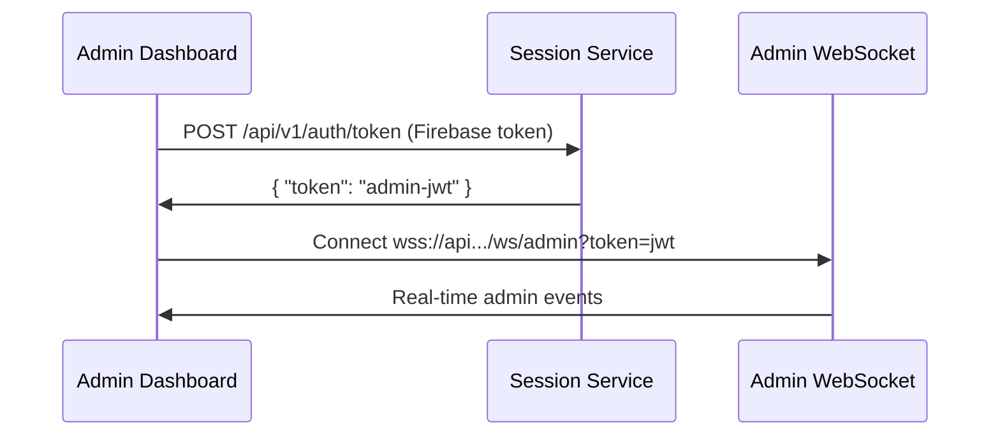

# Turnkey Admin Dashboard Microservice

## Purpose
Delivers the hotelier-facing UI/UX as a **pure presentation layer**. Composes views across services and handles admin operations. **This service does not compute analytics** - it consumes pre-computed metrics from the Analytics service and real-time session signals via WebSocket.

## Microservice Boundaries

### What This Service OWNS
- **UI and UX**: React app/micro-frontend (layout, theming, routing, user preferences)
- **Thin Admin API layer**: UI-specific concerns only (exports, preferences, feature flags)
- **WebSocket subscription client**: Receives real-time updates (does not broadcast)
- **View composition**: Combines pre-computed metrics with live session data
- **Admin operations**: User management, property configuration (via API calls)

### What This Service CONSUMES
- **Analytics API**: All KPIs, funnels, heatmaps, top lists, trends from `/api/v1/analytics/*`
- **Admin WebSocket**: Real-time session updates via authenticated `/ws/admin` connection
- **Session Service**: Admin JWT token acquisition for WebSocket authentication
- **Firebase Auth**: Token validation for Session service authentication

### What This Service DOES NOT DO
- **Database Access**: Never queries BigQuery, Firestore, or any database directly
- **Metric Computation**: Never calculates aggregates, rates, or any metrics
- **Event Processing**: Never transforms or processes raw events
- **WebSocket Broadcasting**: Does not push events to other services
- **Session Management**: Does not write or manage session lifecycle
- **Data Storage**: Never writes to any database

## Core Principles
1. **Presentation Only**: UI/UX layer that displays pre-computed metrics
2. **Database-Per-Service**: Never access other services' databases directly
3. **API-First Communication**: All cross-service data via APIs only
4. **Real-time via WebSocket**: Subscribe to events for live updates
5. **Cache-First Strategy**: Use React Query for intelligent caching
6. **No Client-Side Computation**: All metrics come pre-calculated from Analytics API

## Data Flow Architecture

### Real-Time Flow (ADR-002 Compliant)
```
Session Service (JWT Auth)
        ↓
Admin Dashboard
        ↓
Admin WebSocket (/ws/admin)
        ↓
Live sessions, events, alerts
```

### Analytics Flow
```
Analytics Service
        ↓
  Analytics API
        ↓
Admin Dashboard → Display KPIs, funnels, heatmaps
```

### Key Principles
- **No Direct DB Access**: All data via APIs
- **Admin WebSocket**: JWT-authenticated real-time connection per ADR-002
- **Pre-Computed Metrics**: Analytics service owns all calculations
- **Separation of Concerns**: UI displays, never computes
- **Feature Flag Migration**: Gradual transition from Events WS to Admin WS

## API Endpoints

### Consumed Analytics Endpoints
- `GET /api/v1/metrics/overview` - KPIs and totals
- `GET /api/v1/metrics/funnel` - Funnel stage analysis
- `GET /api/v1/metrics/realtime` - Live metrics
- `GET /api/v1/metrics/sessions/duration` - Session engagement metrics
- `GET /api/v1/metrics/hourly` - Time-series data
- `GET /api/v1/analytics/heatmap` - 2D heatmap data (pending documentation)
- `GET /api/v1/metrics/top/*` - Top lists (pending documentation)

### Exposed Admin Endpoints
- `GET /api/v1/admin/preferences` - User preferences
- `POST /api/v1/admin/export` - Export functionality
- `GET /api/v1/admin/features` - Feature flags

### Session Service Integration
- `POST /api/v1/auth/token` - Admin JWT acquisition for WebSocket authentication

### Admin WebSocket Events (ADR-002)
Connection: `wss://api.turnkeyhms.com/ws/admin?token=<admin-jwt>`

```typescript
// Admin WebSocket authentication
{
  "type": "subscribe",
  "payload": {
    "clientType": "admin",
    "propertyId": "prop_123",
    "subscriptions": ["session.*", "event.*", "analytics.*"]
  }
}

// Real-time session update
{
  "type": "session.updated",
  "payload": {
    "session": {
      "sessionId": "sess_abc123",
      "stage": "viewing_room",
      "timestamp": "2025-01-14T10:00:00Z"
    },
    "propertyId": "prop_123"
  }
}

// Real-time analytics metrics
{
  "type": "analytics.metrics.updated",
  "payload": {
    "activeUsers": 42,
    "totalSearches": 156,
    "bookRate": 0.15,
    "propertyId": "prop_123"
  }
}
```

## Module Decision Matrix

| UI Module | Data Source | Display Method | Why |
|-----------|-------------|----------------|-----|
| **KPI Tiles** | Analytics API | Custom UI or Grafana | Pre-computed metrics |
| **Live Sessions** | Admin WebSocket | Custom UI only | Real-time updates |
| **2D Heatmap** | Analytics API | Grafana preferred | Complex visualization |
| **Funnel** | Analytics API | Custom UI or Grafana | Stage analysis |
| **Top Lists** | Analytics API | Grafana preferred | Aggregated data |
| **Active Users** | Admin WebSocket | Custom UI only | Live counter |
| **Revenue Trends** | Analytics API | Grafana preferred | Time-series data |
| **Alerts** | Admin WebSocket | Custom UI only | Real-time notifications |

## RACI Matrix

| Capability | Responsible | Accountable | Consulted | Informed |
|------------|-------------|-------------|-----------|----------|
| **UI/UX Delivery** | Admin Dashboard | Admin Dashboard | Analytics | Session |
| **Metrics Computation** | Analytics | Analytics | - | Admin Dashboard |
| **Admin JWT Auth** | Session | Session | - | Admin Dashboard |
| **Admin WebSocket** | Admin Dashboard | Admin Dashboard | Session | - |
| **Historical Analytics** | Analytics | Analytics | - | Admin Dashboard |
| **Real-time Display** | Admin Dashboard | Admin Dashboard | Session | - |
| **User Preferences** | Admin Dashboard | Admin Dashboard | - | - |
| **Token Management** | Session | Session | - | Admin Dashboard |

## Anti-Patterns to Avoid

### ❌ NEVER DO THIS
```javascript
// WRONG - Direct database query
const query = `SELECT COUNT(*) FROM events WHERE...`;
const results = await bigquery.query(query);

// WRONG - Computing metrics in browser
const conversionRate = sessions.filter(s => s.booked).length / sessions.length;

// WRONG - Direct Firestore access
const sessions = await firestore.collection('sessions').get();
```

### ✅ ALWAYS DO THIS
```javascript
// CORRECT - Use Analytics API
const metrics = await fetch('/api/v1/analytics/metrics/overview');

// CORRECT - Display pre-computed metrics
const { conversionRate } = await analyticsAPI.getMetrics();

// CORRECT - Use Admin WebSocket with JWT
const token = await adminTokenService.getAdminToken();
const ws = new WebSocket(`wss://api.turnkeyhms.com/ws/admin?token=${token}`);
ws.on('session.updated', (data) => updateUI(data));
```

## Development Guidelines

### Architecture Rules
- **Never query databases directly** - always use APIs
- **Never compute metrics** - request from Analytics API
- **Never process events** - display only
- **Never write to databases** - read-only service
- **Always use TypeScript** strict mode
- **Always implement error boundaries** for modules
- **Follow data flow**: UI → Hook → Service → API

### Technology Stack
- React 18+ with TypeScript
- Admin WebSocket with JWT authentication
- React Query for cache management
- Module federation ready
- Firebase Auth + Session service integration
- Optional Grafana embedding

### Performance Requirements
- Sub-100ms UI updates for real-time
- Graceful degradation on failures
- Support 100+ concurrent users
- Intelligent caching strategy

## Implementation Roadmap

### ✅ Phase A - ADR-002 Compliance (COMPLETED)
- ✅ Admin JWT token acquisition from Session service
- ✅ Admin WebSocket connection with authentication
- ✅ Feature flag controlled migration
- ✅ Fallback mechanism for emergency rollback
- ✅ Events WS dependency elimination

### Phase B - Grafana Integration (Next)
- Embed Grafana for historical dashboards
- Route `/admin/analytics/*` to Grafana
- Keep real-time in custom UI
- Ensure SSO consistency

### Phase C - Optimization (Future)
- Add circuit breakers
- Implement request tracing
- Optimize caching strategy
- Performance monitoring

## Critical Constraints

### Security
- No direct database access
- JWT-authenticated WebSocket connections
- Admin token acquisition via Session service
- Sanitize all user inputs
- Secure WebSocket connections (wss://)

### Data Integrity
- Single source of truth: Analytics service
- No duplicate calculations
- Consistent metric definitions
- Event-driven updates

### Integration Points

#### Consumes From
- **Analytics Service**: All metrics via REST API
- **Session Service**: Admin JWT tokens for WebSocket authentication
- **Admin WebSocket**: Real-time session and analytics events
- **Firebase Auth**: User authentication for Session service

#### Provides To
- **End Users**: Hotelier dashboard UI
- **API Gateway**: Admin-specific endpoints

## Data Ownership Matrix

| Data Type | Owner Service | Admin Dashboard Role |
|-----------|--------------|---------------------|
| Session State | Session/Events | Display only via Admin WebSocket |
| Raw Events | Session/Events | No access |
| Computed Metrics | Analytics | Display via API |
| Funnel Calculations | Analytics | Display via API |
| Heatmap Aggregations | Analytics | Display via API/Grafana |
| Historical Analytics | Analytics | Display via API/Grafana |
| Admin JWT Tokens | Session | Acquire and manage for auth |
| Admin WebSocket | **Admin Dashboard** | Full connection ownership |
| UI State | **Admin Dashboard** | Full ownership |
| User Preferences | **Admin Dashboard** | Full ownership |

## Module Decision Framework

### Use Custom UI When:
- Real-time data via Admin WebSocket (live tables, instant counters)
- Tight coupling to admin actions required
- Sub-second update requirements
- Unique interaction patterns
- Brand-specific UI requirements

### Use Grafana When:
- Historical/aggregate data from BigQuery
- Standard visualizations (charts, tables, maps)
- Can be expressed as SQL query/view
- Refresh-on-load semantics acceptable
- Complex time-series analysis

## Testing Strategy

### Unit Tests
- Component rendering tests
- Hook logic testing
- Service layer mocking

### Integration Tests
- API endpoint consumption
- WebSocket connection handling
- Error boundary behavior

### E2E Tests
- User flow validation
- Real-time update verification
- Cross-browser compatibility

## Monitoring & Observability

### Metrics to Track
- API response times
- Admin WebSocket connection stability
- Admin JWT token acquisition times
- Component render performance
- Cache hit rates

### Logging
- User actions
- API errors
- Admin WebSocket disconnections
- JWT token acquisition failures
- Performance bottlenecks

## Future Enhancements

### Planned Features
- Advanced filtering and segmentation UI
- Customizable dashboard layouts
- Export scheduling interface
- Alert configuration UI

### Technical Roadmap
- Micro-frontend architecture
- Progressive Web App capabilities
- Offline mode with sync
- Advanced state management

## Admin WebSocket Migration (ADR-002)

### Migration Completed ✅
As of December 2024, the Admin Dashboard has successfully migrated from Events WebSocket to dedicated Admin WebSocket per ADR-002.

### Architecture Changes
- **Before**: Events WS → Admin Dashboard (coupled to Events service)
- **After**: Session Service JWT → Admin WebSocket → Admin Dashboard (decoupled)

### Implementation Details
- **Token Service**: `adminTokenService.ts` handles JWT acquisition from Session service
- **WebSocket Hook**: `useAdminWebSocket.ts` manages authenticated connections
- **Fallback Hook**: `useAdminRealtimeWebSocket.ts` orchestrates migration with fallback
- **Feature Flags**: Controlled rollout via `VITE_FEATURE_USE_ADMIN_WS`

### Deployment Strategy
1. **Staging**: Enable `VITE_FEATURE_USE_ADMIN_WS=true`
2. **Verification**: All admin real-time features working
3. **Production**: Feature flag enabled after validation
4. **Cleanup**: Remove Events WS dependencies

### Connection Flow


## Integration Guides

### External Service Integration
- [Analytics API Integration](./docs/integration/ANALYTICS_API_INTEGRATION.md) - Complete Analytics service integration guide with API contracts, WebSocket patterns, and error handling

## Related Documentation
- [SERVICE_BOUNDARIES.md](./docs/SERVICE_BOUNDARIES.md) - Detailed boundary definitions
- [ADMIN_DASHBOARD_SCOPE.md](./docs/ADMIN_DASHBOARD_SCOPE.md) - Service scope
- [DEPLOYMENT_GUIDE.md](./docs/DEPLOYMENT_GUIDE.md) - Deployment instructions
- Analytics Service CLAUDE.md - Analytics boundaries