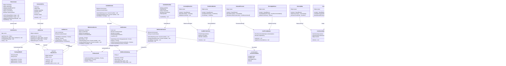

```mermaid
classDiagram
    %% TurnkeyHMS Admin Dashboard - Complete Architecture

    %% External Systems
    class TurnkeyHMSAPI {
        -String baseURL
        -String version
        +getAnalytics() Promise
        +getRevenue() Promise
        +getSessions() Promise
    }

    class WebSocketGateway {
        -String url
        +connect() Promise
        +disconnect() void
        +subscribe(String event) void
        +emit(String event, Object data) void
    }

    class FirebaseAuth {
        +authenticate(Object credentials) Promise
        +refreshToken() Promise
        +logout() Promise
    }

    %% React Contexts
    class AuthContext {
        +User user
        +Boolean isAuthenticated
        +Boolean isLoading
        +Permission[] permissions
        +UserRole role
        +login(String email, String password) Promise
        +logout() Promise
        +hasPermission(Permission permission) Boolean
        +canAccess(String resource) Boolean
    }

    class WebSocketContext {
        +Boolean isConnected
        +String connectionStatus
        +subscribe(String event, Function handler) void
        +unsubscribe(String event, Function handler) void
        +send(Object message) void
        +reconnect() void
    }

    class FilterContext {
        +Object timeRange
        +Object dateRange
        +String[] selectedProperties
        +String searchQuery
        +Object customFilters
        +setTimeRange(Object range) void
        +setDateRange(Object range) void
        +toggleProperty(String propertyId) void
        +clearFilters() void
        +Boolean hasActiveFilters
    }

    %% Service Layer
    class BaseService {
        <<abstract>>
        #Object apiClient
        #Object cache
        +initialize() void
        +destroy() void
        #handleError(Error error) void
    }

    class APIService {
        +Object endpoints
        +get(String url) Promise
        +post(String url, Object data) Promise
        +put(String url, Object data) Promise
        +delete(String url) Promise
    }

    class WebSocketService {
        -WebSocket connection
        -Object eventEmitter
        -Object[] messageQueue
        -Number reconnectAttempts
        +connect() Promise
        +disconnect() void
        +subscribe(String event, Function handler) void
        +unsubscribe(String event, Function handler) void
        +send(Object message) void
    }

    class CacheService {
        -Map cache
        +get(String key) Object
        +set(String key, Object value, Number ttl) void
        +invalidate(String key) void
        +clear() void
    }

    class AuthService {
        +User currentUser
        +Boolean isAuthenticated
        +login(Object credentials) Promise
        +logout() Promise
        +refreshToken() Promise
        +getPermissions() Permission[]
    }

    %% Custom Hooks
    class UseRealtimeData {
        +String eventType
        +Object[] data
        +Object latestData
        +Boolean isConnected
        +Object[] buffer
        +clearBuffer() void
    }

    class UseCacheFirst {
        +String key
        +Object data
        +Boolean isLoading
        +Boolean isError
        +Error error
        +Boolean isStale
        +refetch() void
    }

    class UseWebSocket {
        +Boolean isConnected
        +String connectionStatus
        +subscribe(String event, Function handler) void
        +unsubscribe(String event, Function handler) void
        +send(Object message) void
    }

    %% AI Insights Components
    class PredictiveModels {
        +Object props
        +render() ReactElement
        -calculatePredictions() Prediction[]
        -formatData() ChartData
    }

    class AnomalyDetection {
        +Object props
        +render() ReactElement
        -detectAnomalies() Anomaly[]
        -highlightAnomalies() void
    }

    class UseMLPredictions {
        +Prediction[] predictions
        +Boolean isLoading
        +Number confidence
        +refresh() void
    }

    %% Revenue Management Components
    class PricingOptimizer {
        +Object props
        +render() ReactElement
        -calculateOptimalPricing() PriceRecommendation[]
        -validatePriceRules() Boolean
    }

    class DemandForecast {
        +Object props
        +render() ReactElement
        -generateForecast() ForecastData
        -calculateConfidenceIntervals() ConfidenceInterval[]
    }

    class UsePricingEngine {
        +PriceRecommendation[] recommendations
        +Boolean isOptimizing
        +optimize() void
        +applyRecommendations() void
    }

    %% Session Analytics Components
    class ConversionFunnel {
        +Object props
        +render() ReactElement
        -calculateConversionRates() ConversionRate[]
        -identifyDropOffPoints() DropOffPoint[]
    }

    class JourneyMap {
        +Object props
        +render() ReactElement
        -mapUserJourney() JourneyStep[]
        -calculateTimeSpent() Duration[]
    }

    class UseSessionData {
        +UserSession[] sessions
        +UserSession[] activeSessions
        +Object metrics
        +refresh() void
    }

    %% Shared Components
    class BaseComponent {
        <<abstract>>
        +Object props
        +render() ReactElement
        #handleError(Error error) void
        #validateProps() Boolean
    }

    class DataTable {
        +Object[] data
        +Column[] columns
        +Boolean sortable
        +Boolean filterable
        +onSort(String column, String direction) void
        +onFilter(Object filters) void
    }

    class LoadingStates {
        +String type
        +String message
        +Number progress
        +render() ReactElement
    }

    class ErrorBoundary {
        +Boolean hasError
        +Error error
        +componentDidCatch(Error error, Object errorInfo) void
        +render() ReactElement
    }

    %% Layout Components
    class DashboardShell {
        +ReactNode children
        +Boolean sidebar
        +Object navigation
        +render() ReactElement
    }

    class NavigationBar {
        +User user
        +Notification[] notifications
        +onLogout() void
        +render() ReactElement
    }

    class TimeFilterControls {
        +Object timeRange
        +Object[] presets
        +onChange(Object range) void
        +render() ReactElement
    }

    %% Data Models
    class User {
        +String id
        +String email
        +String name
        +UserRole role
        +Permission[] permissions
        +Date lastLogin
    }

    class UserSession {
        +String id
        +String userId
        +Date startTime
        +Date endTime
        +SessionEvent[] events
        +Object deviceInfo
        +Object location
    }

    class SessionEvent {
        +String id
        +EventType type
        +Date timestamp
        +Object data
        +String sessionId
    }

    %% Enums
    class UserRole {
        <<enumeration>>
        ADMIN
        MANAGER
        ANALYST
        VIEWER
    }

    class EventType {
        <<enumeration>>
        PAGE_VIEW
        BOOKING_ATTEMPT
        BOOKING_COMPLETE
        SESSION_START
        SESSION_END
    }

    class ConnectionStatus {
        <<enumeration>>
        CONNECTING
        CONNECTED
        DISCONNECTED
        ERROR
    }

    %% External System Relationships
    AuthContext --> FirebaseAuth : "authenticates via"
    WebSocketContext --> WebSocketGateway : "connects to"
    FilterContext --> CacheService : "persists state"

    %% Service Layer Relationships
    APIService --|> BaseService : "extends"
    WebSocketService --|> BaseService : "extends"
    CacheService --|> BaseService : "extends"
    AuthService --|> BaseService : "extends"

    APIService --> TurnkeyHMSAPI : "communicates with"
    WebSocketService --> WebSocketGateway : "manages connection"
    AuthService --> FirebaseAuth : "integrates with"

    %% Hook Dependencies
    UseRealtimeData --> WebSocketContext : "subscribes to"
    UseCacheFirst --> APIService : "fetches data"
    UseWebSocket --> WebSocketContext : "accesses"

    %% AI Insights Module
    PredictiveModels --> UseMLPredictions : "uses predictions"
    AnomalyDetection --> UseMLPredictions : "detects anomalies"

    %% Revenue Management Module
    PricingOptimizer --> UsePricingEngine : "optimizes pricing"
    DemandForecast --> UsePricingEngine : "forecasts demand"

    %% Session Analytics Module
    ConversionFunnel --> UseSessionData : "analyzes conversions"
    JourneyMap --> UseSessionData : "maps journeys"

    %% Component Hierarchy
    DataTable --|> BaseComponent : "extends"
    LoadingStates --|> BaseComponent : "extends"
    ErrorBoundary --|> BaseComponent : "extends"
    DashboardShell --|> BaseComponent : "extends"
    NavigationBar --|> BaseComponent : "extends"
    TimeFilterControls --|> BaseComponent : "extends"

    %% Layout Composition
    DashboardShell *-- NavigationBar : "contains"
    DashboardShell *-- TimeFilterControls : "contains"

    %% Data Model Relationships
    User --> UserRole : "has role"
    UserSession *-- SessionEvent : "contains events"
    SessionEvent --> EventType : "of type"
    WebSocketContext --> ConnectionStatus : "has status"
```
