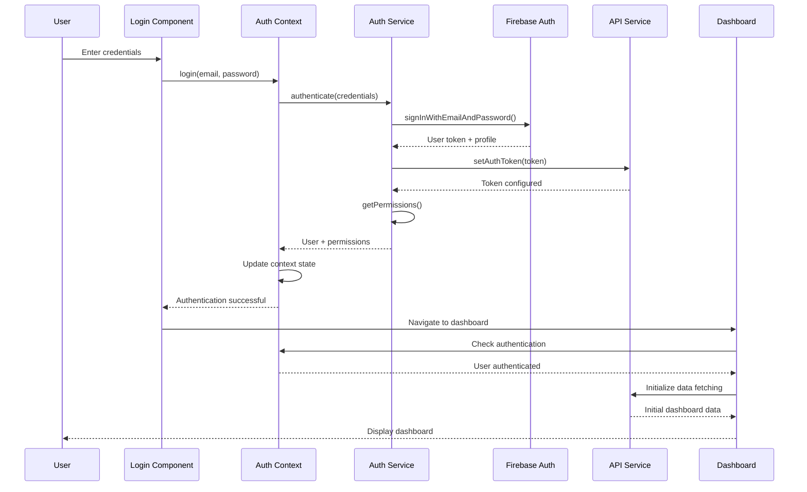
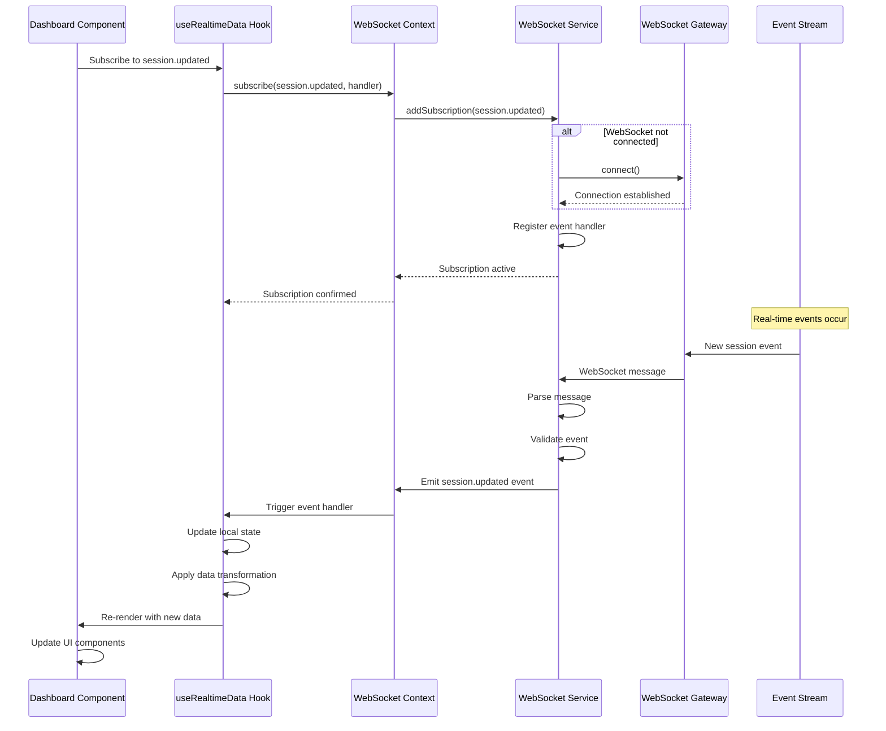
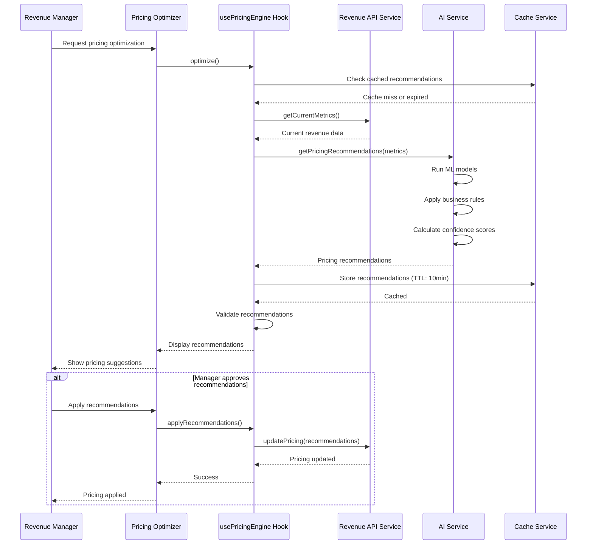
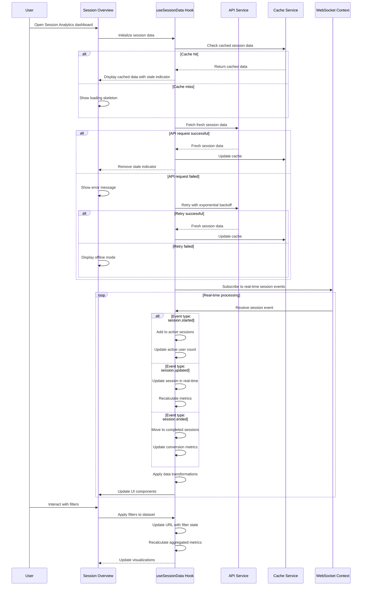
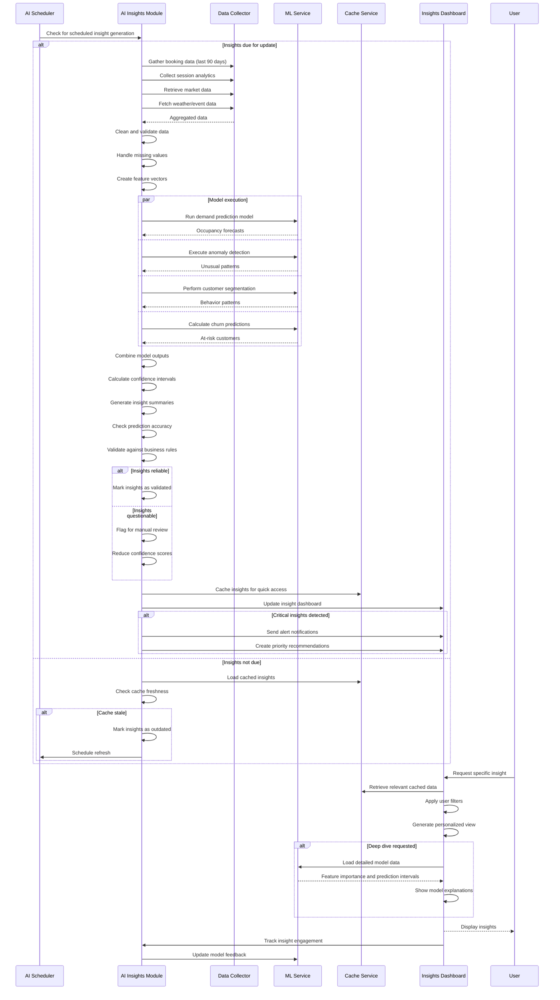

## Authentication Flow

```mermaid
sequenceDiagram
    participant User
    participant LoginComponent as Login Component
    participant AuthContext as Auth Context
    participant AuthService as Auth Service
    participant FirebaseAuth as Firebase Auth
    participant APIService as API Service
    participant Dashboard

    User->>LoginComponent: Enter credentials
    LoginComponent->>AuthContext: login(email, password)
    AuthContext->>AuthService: authenticate(credentials)
    AuthService->>FirebaseAuth: signInWithEmailAndPassword()
    FirebaseAuth-->>AuthService: User token + profile
    AuthService->>APIService: setAuthToken(token)
    APIService-->>AuthService: Token configured
    AuthService->>AuthService: getPermissions()
    AuthService-->>AuthContext: User + permissions
    AuthContext->>AuthContext: Update context state
    AuthContext-->>LoginComponent: Authentication successful
    LoginComponent->>Dashboard: Navigate to dashboard
    Dashboard->>AuthContext: Check authentication
    AuthContext-->>Dashboard: User authenticated
    Dashboard->>APIService: Initialize data fetching
    APIService-->>Dashboard: Initial dashboard data
    Dashboard-->>User: Display dashboard
```

## Real-time Data Streaming Flow

```mermaid
sequenceDiagram
    participant Dashboard as Dashboard Component
    participant Hook as useRealtimeData Hook
    participant WSContext as WebSocket Context
    participant WSService as WebSocket Service
    participant WSGateway as WebSocket Gateway
    participant EventStream as Event Stream

    Dashboard->>Hook: Subscribe to session.updated
    Hook->>WSContext: subscribe(session.updated, handler)
    WSContext->>WSService: addSubscription(session.updated)
    
    alt WebSocket not connected
        WSService->>WSGateway: connect()
        WSGateway-->>WSService: Connection established
    end
    
    WSService->>WSService: Register event handler
    WSService-->>WSContext: Subscription active
    WSContext-->>Hook: Subscription confirmed
    
    Note over EventStream: Real-time events occur
    
    EventStream->>WSGateway: New session event
    WSGateway->>WSService: WebSocket message
    WSService->>WSService: Parse message
    WSService->>WSService: Validate event
    WSService->>WSContext: Emit session.updated event
    WSContext->>Hook: Trigger event handler
    Hook->>Hook: Update local state
    Hook->>Hook: Apply data transformation
    Hook->>Dashboard: Re-render with new data
    Dashboard->>Dashboard: Update UI components
```

## Revenue Optimization Flow

```mermaid
sequenceDiagram
    participant Manager as Revenue Manager
    participant PricingComp as Pricing Optimizer
    participant PricingHook as usePricingEngine Hook
    participant RevenueAPI as Revenue API Service
    participant AIService as AI Service
    participant Cache as Cache Service

    Manager->>PricingComp: Request pricing optimization
    PricingComp->>PricingHook: optimize()
    PricingHook->>Cache: Check cached recommendations
    Cache-->>PricingHook: Cache miss or expired
    PricingHook->>RevenueAPI: getCurrentMetrics()
    RevenueAPI-->>PricingHook: Current revenue data
    PricingHook->>AIService: getPricingRecommendations(metrics)
    
    AIService->>AIService: Run ML models
    AIService->>AIService: Apply business rules
    AIService->>AIService: Calculate confidence scores
    
    AIService-->>PricingHook: Pricing recommendations
    PricingHook->>Cache: Store recommendations (TTL: 10min)
    Cache-->>PricingHook: Cached
    PricingHook->>PricingHook: Validate recommendations
    PricingHook-->>PricingComp: Display recommendations
    PricingComp-->>Manager: Show pricing suggestions
    
    alt Manager approves recommendations
        Manager->>PricingComp: Apply recommendations
        PricingComp->>PricingHook: applyRecommendations()
        PricingHook->>RevenueAPI: updatePricing(recommendations)
        RevenueAPI-->>PricingHook: Pricing updated
        PricingHook-->>PricingComp: Success
        PricingComp-->>Manager: Pricing applied
    end
```

## Session Analytics Analysis Flow

```mermaid
sequenceDiagram
    participant User
    participant SessionOverview as Session Overview
    participant SessionHook as useSessionData Hook
    participant APIService as API Service
    participant Cache as Cache Service
    participant WSContext as WebSocket Context

    User->>SessionOverview: Open Session Analytics dashboard
    SessionOverview->>SessionHook: Initialize session data
    SessionHook->>Cache: Check cached session data
    
    alt Cache hit
        Cache-->>SessionHook: Return cached data
        SessionHook-->>SessionOverview: Display cached data with stale indicator
    else Cache miss
        SessionOverview->>SessionOverview: Show loading skeleton
    end
    
    SessionHook->>APIService: Fetch fresh session data
    
    alt API request successful
        APIService-->>SessionHook: Fresh session data
        SessionHook->>Cache: Update cache
        SessionHook-->>SessionOverview: Remove stale indicator
    else API request failed
        SessionOverview->>SessionOverview: Show error message
        SessionHook->>APIService: Retry with exponential backoff
        alt Retry successful
            APIService-->>SessionHook: Fresh session data
            SessionHook->>Cache: Update cache
        else Retry failed
            SessionOverview->>SessionOverview: Display offline mode
        end
    end
    
    SessionHook->>WSContext: Subscribe to real-time session events
    
    loop Real-time processing
        WSContext->>SessionHook: Receive session event
        alt Event type: session.started
            SessionHook->>SessionHook: Add to active sessions
            SessionHook->>SessionHook: Update active user count
        else Event type: session.updated
            SessionHook->>SessionHook: Update session in real-time
            SessionHook->>SessionHook: Recalculate metrics
        else Event type: session.ended
            SessionHook->>SessionHook: Move to completed sessions
            SessionHook->>SessionHook: Update conversion metrics
        end
        SessionHook->>SessionHook: Apply data transformations
        SessionHook->>SessionOverview: Update UI components
    end
    
    User->>SessionOverview: Interact with filters
    SessionOverview->>SessionHook: Apply filters to dataset
    SessionHook->>SessionHook: Update URL with filter state
    SessionHook->>SessionHook: Recalculate aggregated metrics
    SessionHook-->>SessionOverview: Update visualizations
```

## AI Insights Generation Flow

```mermaid
sequenceDiagram
    participant Scheduler as AI Scheduler
    participant AIModule as AI Insights Module
    participant DataCollector as Data Collector
    participant MLService as ML Service
    participant Cache as Cache Service
    participant Dashboard as Insights Dashboard
    participant User

    Scheduler->>AIModule: Check for scheduled insight generation
    
    alt Insights due for update
        AIModule->>DataCollector: Gather booking data (last 90 days)
        AIModule->>DataCollector: Collect session analytics
        AIModule->>DataCollector: Retrieve market data
        AIModule->>DataCollector: Fetch weather/event data
        DataCollector-->>AIModule: Aggregated data
        
        AIModule->>AIModule: Clean and validate data
        AIModule->>AIModule: Handle missing values
        AIModule->>AIModule: Create feature vectors
        
        par Model execution
            AIModule->>MLService: Run demand prediction model
            MLService-->>AIModule: Occupancy forecasts
        and
            AIModule->>MLService: Execute anomaly detection
            MLService-->>AIModule: Unusual patterns
        and
            AIModule->>MLService: Perform customer segmentation
            MLService-->>AIModule: Behavior patterns
        and
            AIModule->>MLService: Calculate churn predictions
            MLService-->>AIModule: At-risk customers
        end
        
        AIModule->>AIModule: Combine model outputs
        AIModule->>AIModule: Calculate confidence intervals
        AIModule->>AIModule: Generate insight summaries
        
        AIModule->>AIModule: Check prediction accuracy
        AIModule->>AIModule: Validate against business rules
        
        alt Insights reliable
            AIModule->>AIModule: Mark insights as validated
        else Insights questionable
            AIModule->>AIModule: Flag for manual review
            AIModule->>AIModule: Reduce confidence scores
        end
        
        AIModule->>Cache: Cache insights for quick access
        AIModule->>Dashboard: Update insight dashboard
        
        alt Critical insights detected
            AIModule->>Dashboard: Send alert notifications
            AIModule->>Dashboard: Create priority recommendations
        end
        
    else Insights not due
        AIModule->>Cache: Load cached insights
        AIModule->>AIModule: Check cache freshness
        alt Cache stale
            AIModule->>AIModule: Mark insights as outdated
            AIModule->>Scheduler: Schedule refresh
        end
    end
    
    User->>Dashboard: Request specific insight
    Dashboard->>Cache: Retrieve relevant cached data
    Dashboard->>Dashboard: Apply user filters
    Dashboard->>Dashboard: Generate personalized view
    
    alt Deep dive requested
        Dashboard->>MLService: Load detailed model data
        MLService-->>Dashboard: Feature importance and prediction intervals
        Dashboard->>Dashboard: Show model explanations
    end
    
    Dashboard-->>User: Display insights
    Dashboard->>AIModule: Track insight engagement
    AIModule->>MLService: Update model feedback
```
